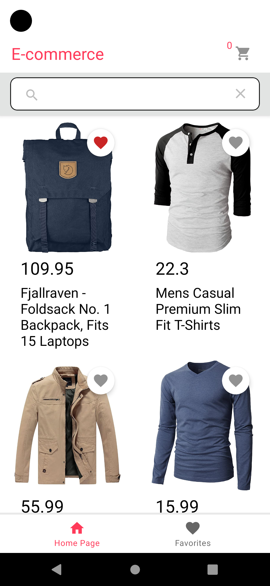
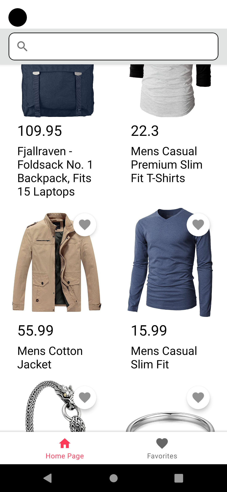
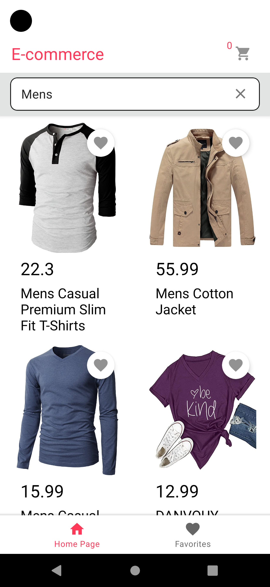

# E-commerce App 

This is a Kotlin Ecommerce project using firebase firestore and public api.

- The project is made for learning purposes, so you can make contribution.

## Demo

Demoya gif veya bağlantı ekleyin

## Features

- Search for products
- Add to favorites
- Add to cart
- Change the number of items in the cart

## Screenshots

  
   
  

## Technologies

- Kotlin
- MVVM Architecture
- Live Data
- Kotlin Coroutines
- Jetpack Navigation
- Picasso
- ViewBinding
- Lottie Animations
- Firebase Firestore
- FlexBox Layout
- Retrofit 2
  
