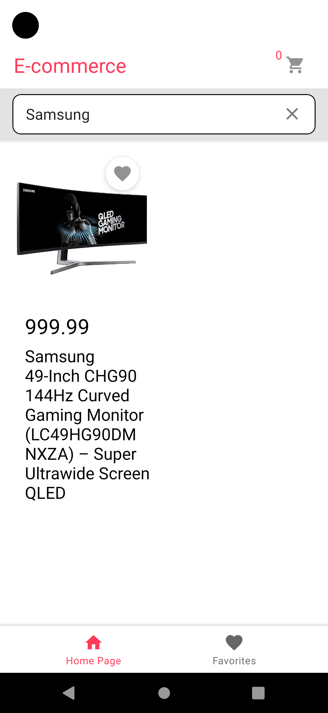
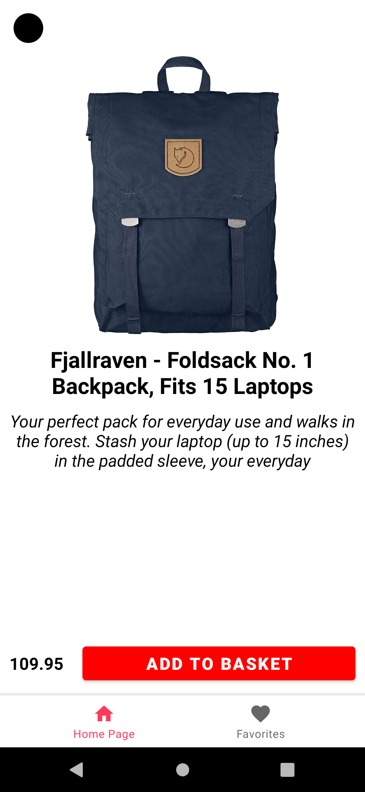
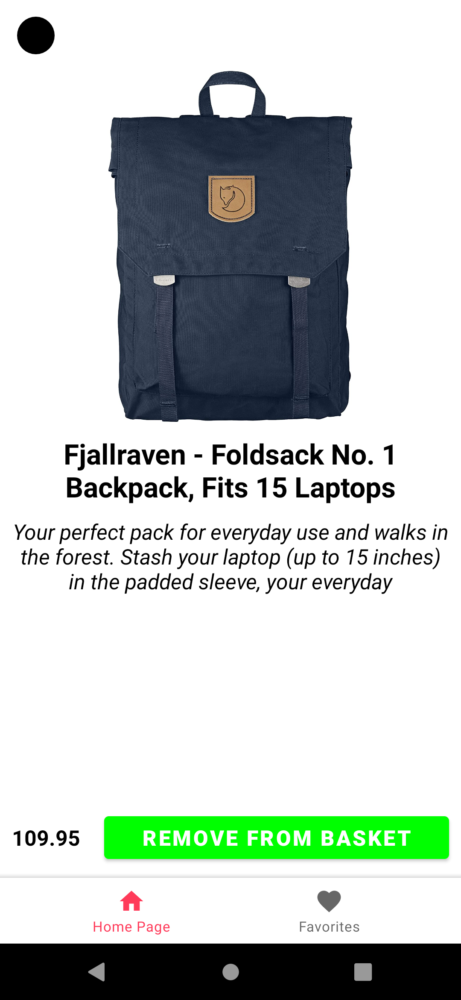

# E-commerce App 

This is a Kotlin Ecommerce project using firebase firestore and public API.

- The project is made for learning purposes, so you can make a contribution.

## Demo

Demoya gif veya bağlantı ekleyin

## Features

- Search for products
- Add to favorites
- Add to cart
- Change the number of items in the cart

# Screenshots

## Homepage

  
   
  

## Favorite Page

  
   

## Basket Page

  
   
   
 

## Detail Page

  
   

## Technologies

- Kotlin
- MVVM Architecture
- Live Data
- Kotlin Coroutines
- Jetpack Navigation
- Picasso
- ViewBinding
- Lottie Animations
- Firebase Firestore
- FlexBox Layout
- Retrofit 2
  
